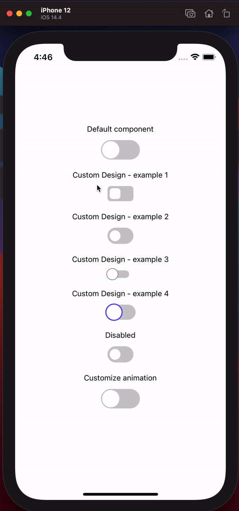

# react-native-reanimated-toggle

React native toggle component built with react-native-reanimated

- [x] Built with Reanimated v2
- [x] Built with typescript
- [x] Customizable
- [ ] Support for gestures

## Installation
For this component to work you need to have installed [react-native-reanimated](https://github.com/software-mansion/react-native-reanimated)
```sh
yarn add react-native-reanimated-toggle
```
```sh
npm install react-native-reanimated-toggle
```
## Usage

### Default component
```jsx
import { View } from 'react-native';
import Toggle from 'react-native-reanimated-toggle';

const App = () => {
  const [toggled, setToggled] = useState(false);
  return <View>
    <Toggle toggled={toggled} onChange={setToggled} />
  </View>
}
```
### Customize design
```jsx
import { View } from 'react-native';
import Toggle from 'react-native-reanimated-toggle';

const App = () => {
  const [toggled, setToggled] = useState(false);
  return <Toggle
    toggled={toggled}
    onChange={setToggled}
    thumbOffset={4}
    activeTrackColor="orange"
    trackStyle={{ height: 30, width: 48 }}
    thumbSize={20}
  />
}
```
### Demo


For more examples check out expo project in [/example](/example) folder.


## License

MIT


Project bootstrapped with [react-native-builder-bob](https://github.com/callstack/react-native-builder-bob)
